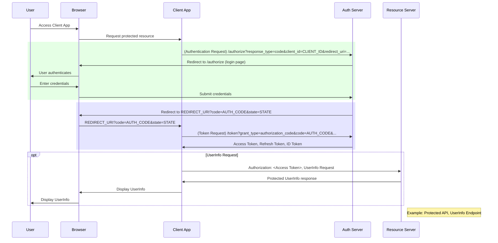

# UserInfo Request

```mermaid
sequenceDiagram
    participant User
    participant Browser
    participant Client App
    participant Auth Server
    participant Resource Server

    User->>Browser: Access Client App
    Browser->>Client App: Request protected resource
    rect rgba(0, 255, 0, .1)
    Client App->>Auth Server: (Authentication Request) /authorize?response_type=code&client_id=CLIENT_ID&redirect_uri=...
    Auth Server->>Browser: Redirect to /authorize (login page)
    Browser->>User: User authenticates
    User->>Browser: Enter credentials
    Browser->>Auth Server: Submit credentials
    end
    rect rgba(0, 0, 255, .1)
        Auth Server->>Browser: Redirect to REDIRECT_URI?code=AUTH_CODE&state=STATE
        Browser->>Client App: REDIRECT_URI?code=AUTH_CODE&state=STATE
        Client App->>Auth Server: (Token Request) /token?grant_type=authorization_code&code=AUTH_CODE&...
        Auth Server->>Client App: Access Token, Refresh Token, ID Token
    end
    opt UserInfo Request
        Client App->>Resource Server: Authorization: <Access Token>, UserInfo Request
        Resource Server->>Client App: Protected UserInfo response
        Client App->>Browser: Display UserInfo
        Browser->>User: Display UserInfo
    end
    Note right of Resource Server: Example: Protected API,  UserInfo Endpoint
```