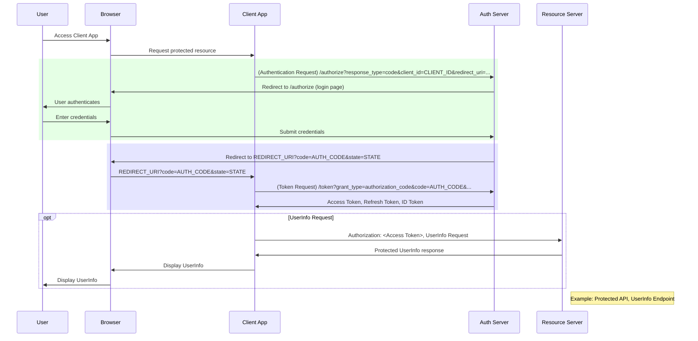

# OpenID Connect UserInfo Request

The UserInfo Endpoint is a protected resource hosted by the OpenID Provider (OP). Its purpose is to return [claims](standard-claims.mdx) about the authenticated user, such as their name, email address, or profile picture.

While some claims can be included directly in the ID Token, fetching them from the UserInfo Endpoint has a few advantages:

* It keeps the [ID Token](id-token.md) small and focused on the authentication event itself.
* It provides a standardized way to retrieve user information that might be updated after the initial login.

A UserInfo Request is a simple, authenticated API call made by your application (the Relying Party) to the UserInfo Endpoint.

Here's how it works:

1. After a successful token exchange, your application has an Access Token.
2. To get the user's claims, your application makes an HTTP `GET` or `POST` request to the UserInfo Endpoint.
3. The request must include the Access Token, typically in the `Authorization` header as a Bearer token (e.g., Authorization: Bearer access_token).

The OpenID Provider validates the Access Token and, if valid, returns a JSON object containing the user's claims.
The claims returned are based on the scope values (profile, email, etc.) that your application requested and the user consented to.

For security, your application must verify that the `sub` (subject) claim in the UserInfo response matches the sub claim from the ID Token to prevent token substitution attacks.

