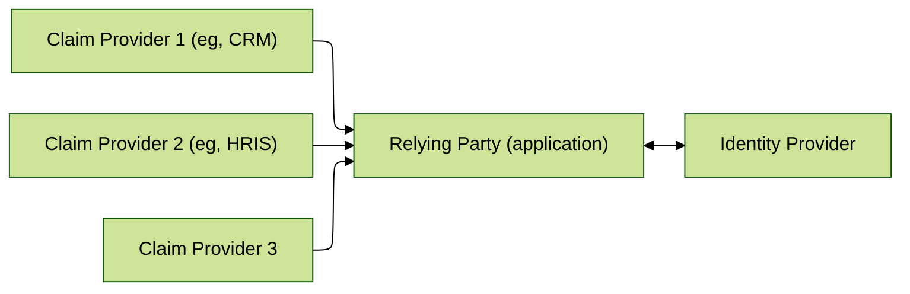

# Aggregated and Distributed Claims in OpenID Connect

## Distributed Claims

```mermaid
flowchart-elk LR
%%{ init : { "theme" : "forest", "flowchart" : { "**curve" : "stepBefore**" }}}%%
    CP1["Claim Provider 1 (eg, CRM)"] --> RP["Relying Party (application)"]
    CP2["Claim Provider 2 (eg, HRIS)"] --> RP
    CP3[Claim Provider 3] --> RP
    RP <---> IdP[Identity Provider]
```
