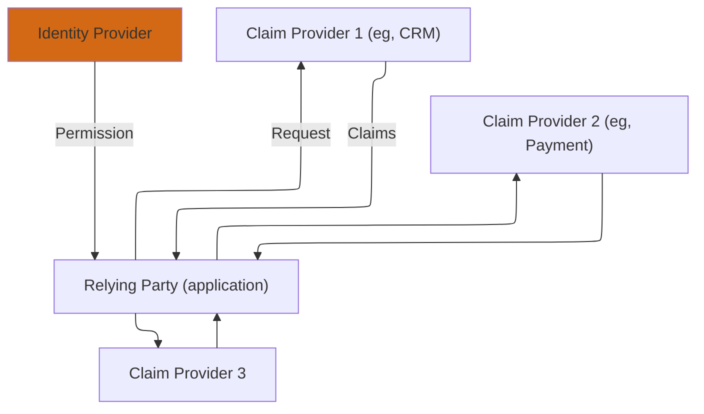
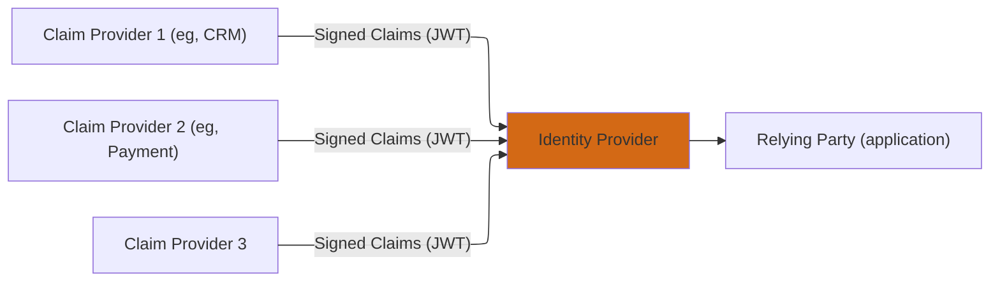

# Aggregated and Distributed Claims in OpenID Connect

In OpenID Connect (OIDC), **[Standard Claims](10-standard-claims.mdx)** (like `sub`, `email`, `name`) and **[Custom Claims](10-standard-claims.mdx#custom-claims)** are attributes directly asserted and digitally signed by the primary **OpenID Provider (OP)**.
However, OIDC includes two mechanisms, **Aggregated Claims** and **Distributed Claims**, that allow an OP to integrate data from external sources, known as **Claims Providers**.
These mechanisms enable the separation of concerns and the integration of specialized attribute authorities.

## Distributed Claims

Distributed Claims are claims that the Identity Provider (OP) delegates the retrieval of to the application (RP).
This is typically used for claims that are too large, volatile, or highly sensitive to include directly in the [ID Token](2-id-token.md) or [UserInfo](11-userinfo-request.md) response.



The OP includes a special JSON object in the UserInfo response or [ID Token](2-id-token.md) instead of the actual claim value.
This JSON object must contain three required fields:

* `claim_names`: An array of strings listing the claims to be retrieved (e.g., `["street_address", "phone_number"]`).
* `endpoint`: The URL of the third-party Claims Provider's API endpoint.
* `access_token`: A Bearer Token the RP must use when calling the `endpoint`.

The RP must make a separate HTTP GET request to the `endpoint` URL, presenting the provided `access_token` in the Authorization header, to fetch the actual claims. This introduces an extra network hop and a dependency on the Claims Provider's availability and security model.

:::note Example Distributed Claims

```json
{
   "sub": "248289761001",
   "name": "Jane Doe",
   "given_name": "Jane",
   "family_name": "Doe",
   "email": "janedoe@example.com",
   "birthdate": "0000-03-22",
   "_claim_names": {
     "country": "src1",
     "is_customer": "src1",
     "payment_info": "src2",
    },
   "_claim_sources": {
     "src1": {
        "endpoint": "https://crm.example.com/claim_source"
     },
     "src2": {
        "endpoint": "https://payments.example.com/claim_source",
        "access_token": "ksj3n283dke"
     }
   }
}
```

*Line breaks for demonstration purposes*
:::

## Aggregated Claims

Aggregated Claims allow a primary OP to pass claims from a third-party Claims Provider to the Relying Party (RP) while still acting as the single assertion point.



### How They are Returned

1. The Claims Provider issues a **JSON Web Token (JWT)** containing the claims (e.g., specific health or tax data) and signs it.
2. The OP receives this JWT.
3. The OP places this entire, signed JWT into a single, special claim, typically named `_aggregated_claims` (or a custom name if negotiated), within the UserInfo response or the ID Token. The OP signs the containing token.

The RP receives the claims within the main token structure, but must then validate the **inner JWT** signature against the public key of the Claims Provider to trust the source of the claims. The claims themselves are not directly at the top level; they are retrieved by decoding and validating the nested JWT.

## Differentiation

| Feature | Standard/Custom Claims | Aggregated Claims | Distributed Claims |
| :--- | :--- | :--- | :--- |
| **Source Asserted By** | Primary OpenID Provider (OP) | Claims Provider | Claims Provider |
| **RP Retrieval Method** | Direct fetch from ID Token or UserInfo Endpoint. | Direct fetch from ID Token or UserInfo Endpoint; requires **nested JWT validation**. | **Separate API call** by the RP to the Claims Provider's endpoint. |
| **Data Flow** | OP $\rightarrow$ RP | Claims Provider $\rightarrow$ OP $\rightarrow$ RP | Claims Provider $\rightarrow$ RP (Direct) |
| **Primary Use Case** | Core identity data. | Integrating claims from partners while maintaining the OP as the delivery channel. | Large, sensitive, or external claims that require an independent fetch. |

## Claims Hierarchy

| Type | How Value is Returned | Assertion of Trust |
| :--- | :--- | :--- |
| **Standard/Custom** | Literal value (e.g., `"John Doe"`). | OP's signature on the token. |
| **Aggregated** | Nested JWT signed by Claims Provider. | OP's signature on the container + Claims Provider's signature on the nested JWT. |
| **Distributed** | JSON object with `endpoint` and `access_token`. | OP's signature on the container + RP must trust the secure channel to the third-party Claims Provider. |

## References

* [OpenID Connect Core 1.0 incorporating errata set 2 - Aggregated and Distributed Claims](https://openid.net/specs/openid-connect-core-1_0.html#AggregatedDistributedClaims)
* [OpenID Connect as a KYC Token distribution protocol](https://ec.europa.eu/futurium/sites/futurium/files/7_nat_sakimura_openid.pdf)
* [OpenID Connect Claims Aggregation Draft 02, 2021](https://openid.net/specs/openid-connect-claims-aggregation-1_0-02.html)
* [OpenID Connect Claims Aggregation 1.0 - Draft 03, 2025](https://openid.net/specs/openid-connect-claims-aggregation-1_0.html)
