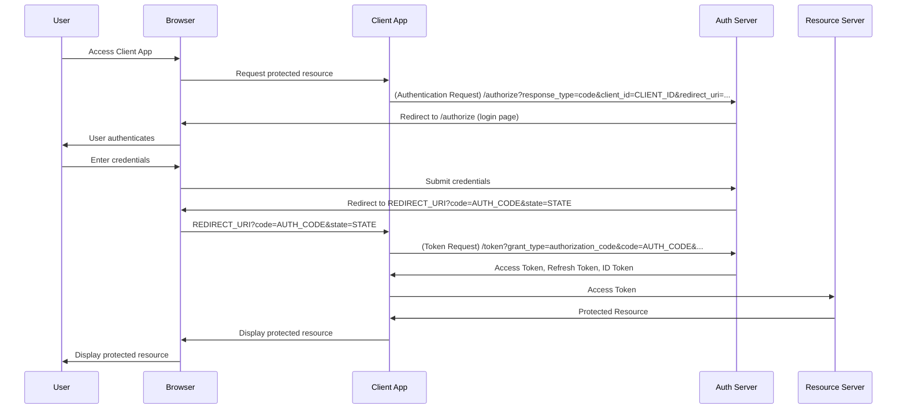

# Authorization Code Flow with Proof Key for Code Exchange (PKCE)

[openid.net/specs/openid-connect-core-1_0.html#CodeFlowAuth](https://openid.net/specs/openid-connect-core-1_0.html#CodeFlowAuth)

OpenID Connect performs authentication to log in the End-User or to determine that the End-User is already logged in.
OpenID Connect returns the result of the Authentication performed by the Server to the Client in a secure manner so that the Client can rely on it.
Authentication can follow multiple paths such as

* Authorization Code Flow
* Implicit Flow ([not recommended](https://datatracker.ietf.org/doc/html/rfc9700#name-implicit-grant))
* Hybrid Flow
* Authorization Code Flow with Proof Key for Code Exchange (PKCE)

[Proof Key for Code Exchange (RFC 7636)](https://www.rfc-editor.org/rfc/rfc7636) is an extension to the Authorization Code Flow to prevent CSRF and authorization code injection attacks.

While the original draft for PKCE was intended to protect public clients, such as mobile applications, the [Best Current Practice for OAuth 2.0 Security](https://datatracker.ietf.org/doc/html/rfc9700#name-authorization-code-grant) recommends Authorization Code Flow with Proof Key for Code Exchange (PKCE) even with confidential client applications.

This means in practice you should always use the Authorization Code Flow with PKCE.

## Sequence of the Authorization Code Flow with PKCE

The Authorization Code Flow goes through the following steps.

1. Client prepares an **Authentication Request** containing the desired request parameters.
1. Client sends the request to the Authorization Server.
1. Authorization Server Authenticates the End-User.
1. Authorization Server obtains End-User Consent/Authorization.
1. Authorization Server sends the End-User back to the Client with an Authorization Code.
1. Client prepares an **Token Request** containing the desired request parameters.
1. Client requests a response using the Authorization Code at the Token Endpoint.
1. Client receives a response that contains an [ID Token](../id-token) and Access Token in the response body.
1. Client validates the ID token and retrieves the End-User's Subject Identifier.

## Resources

* [ Proof Key for Code Exchange (RFC 7636) aka. PKCE](https://www.rfc-editor.org/rfc/rfc7636)
* [Best Current Practice for OAuth 2.0 Security](https://datatracker.ietf.org/doc/html/rfc9700#name-authorization-code-grant)
* [Authentication Request Playground](https://zitadel.com/playgrounds/oidc)
