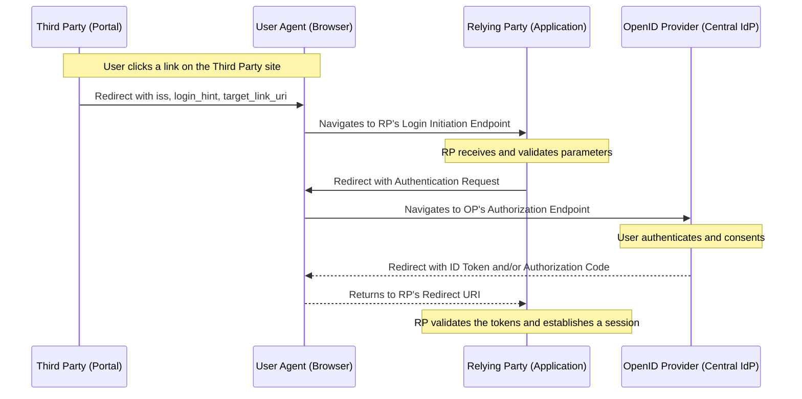

# Initiating Login from a Third Party

[OpenID Connect Core 1.0 incorporating errata set 2 - 4.  Initiating Login from a Third Party](https://openid.net/specs/openid-connect-core-1_0.html#ThirdPartyInitiatedLogin)

Initiating Login from a Third Party describes a mechanism where a party other than the relying party (application) or the user can initiate an authentication request.

Instead of the user directly visiting the RP's site and clicking a login button, a third party (often the OpenID Provider itself) redirects the user to the RP's login initiation endpoint.

This method allows for seamless login experiences where a user might start their journey on one site and be automatically directed to another to complete the login process.

In large organizations a use case might be a central identity platform might host a directory of all available applications. A user logged into this portal can click on an application's icon, and the portal (acting as the third party) initiates the login flow to that specific application, providing a true Single Sign-On (SSO) experience.

