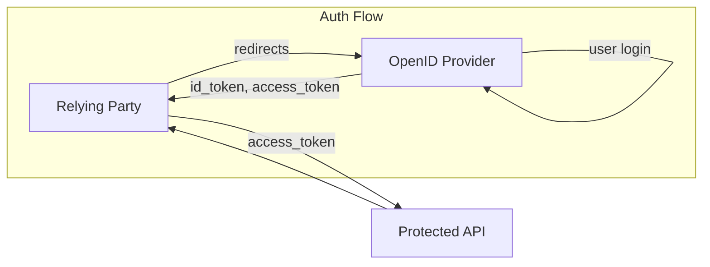

import OidcVsOauth2 from '@site/src/components/OidcVsOauth2'

# OpenID Connect for Developers

Modern digital applications demand secure, and user authentication without friction.
OpenID Connect (OIDC) is a standard that provides a robust login system solution.

This guide provides developers new to OIDC with a clear understanding of its core principles.
It covers OIDC's fundamental concepts, operational mechanisms, authentication flows, key components, benefits, comparisons with other protocols, and crucial secure implementation best practices.

## Key points

* OpenID Connect (OIDC) is an identity authentication protocol built on OAuth 2.0 that standardizes how applications verify user identity, complementing OAuth 2.0's authorization capabilities.  
* OIDC focuses on "who you are" (authentication), while OAuth 2.0 addresses "what you are allowed to do" (authorization), with OIDC extending OAuth 2.0 by adding an identity layer for comprehensive identity and access management.  
* OIDC facilitates user authentication through interactions between an End User, a Relying Party (application), and an OpenID Provider (authentication service), streamlining login and offloading credential management.  
* OIDC offers various flows, with the Authorization Code Flow  with Proof of Key Code Exchange (PKCE) being the most secure and recommended for most application types due to its ability to protect tokens. Make sure to review best practices when implementing OIDC in your application.  
* OIDC utilizes ID Tokens to verify user identity, Access Tokens for delegated authorization to resources, and Refresh Tokens to obtain new tokens without re-authentication, each with distinct purposes and security considerations.

## What Exactly Is OpenID Connect (OIDC)?

OpenID Connect (OIDC), built on OAuth 2.0, is an identity authentication protocol.
It standardizes how applications verify user identity for digital service access.

OIDC complements OAuth 2.0 by adding an authentication layer.
OAuth 2.0 handles authorization (delegated access to protected resources), while OIDC focuses on authentication (verifying user identity). 
This combination provides both identity verification and controlled resource access.

### Key Distinction: Authentication (OIDC) vs. Authorization (OAuth 2.0)

<OidcVsOauth2 />

To fully understand OpenId Connect, it is essential to differentiate between authentication and authorization:

**Authentication:** This is the secure process of confirming a user's identity, answering the fundamental question, "Who are you?" It typically involves a user providing credentials, such as a username and password, which are then verified by an identity provider. OIDC is specifically designed to handle the authentication aspect of identity management.

**Authorization:** This process determines what an authenticated user is permitted to do, or what specific resources an application can access on behalf of that user, addressing the question, "What are you allowed to do?" OAuth 2.0 is the standard protocol tailored for Authorization processes, enabling secure delegated access to resources without exposing the user's primary credentials.

OpenID Connect builds on OAuth 2.0, adding an identity layer to its authorization framework.
OIDC extends, not replaces, OAuth 2.0, providing comprehensive authentication.
They work together for identity and access management.
A common mistake is using an [ID token](2-id-token.md) for resource access instead of an access token, which can cause security vulnerabilities.
An ID Token is only used to answer the question “Who are you?” but not “What are you allowed to do”, the latter is taken care of by Access Tokens.

OIDC's design as an "identity layer on OAuth 2.0" reflects a deliberate architectural choice.
OAuth 2.0 focuses solely on delegated authorization; OIDC fills the user identity verification gap.
This integrated approach offers a powerful solution for both identity verification and resource access, eliminating the need for disparate protocols and leading to a more streamlined, secure identity management system.

## How OpenID Connect Works: The Core Flow and Key Players

The OpenID Connect protocol defines interactions among three primary roles to facilitate user authentication:

* **End User:** This is the individual seeking to access a digital service, whose identity requires verification. In the context of OAuth, this role is often referred to as the "resource owner".  
* **Relying Party (RP):** This is the application or website that needs to verify the user's identity. It relies on an OpenID Provider to perform the authentication process. In OAuth terminology, this is the "client application.”  
* **OpenID Provider (OP):** This is a trusted service responsible for authenticating the end user and issuing identity information (ID Tokens) to the Relying Party. Prominent technology providers are Google, Microsoft, Keycloak, Zitadel, or Okta which function as OpenID Providers.

### The Authentication Flow With OpenID Connect

The OpenID Connect authentication flow involves a **Relying Party (RP)**, which is the application the user wants to log into, and an **OpenID Provider (OP)**, which handles the user's identity.

An OpenID Connect Authentication Flow (Authorization Code Flow with PKCE) follows these steps:

1. **User Initiates Login:** The user, wanting to access a service or application (the **Relying Party**), clicks a 'Sign In' or 'Login' button within the Relying Party's application.  
2. **Redirection to OP:** The Relying Party, acting as an intermediary, redirects the user's browser to the **OpenID Provider's** (OP) authentication endpoint with an [**Authentication Request**](3-authentication-request.md). This redirection includes the Relying Party's unique **client ID** (to identify itself to the OP) and specifies the requested [**identity scopes**](9-standard-openid-connect-scopes.md) (the specific user information, like profile or email, it needs from the OP).  
3. **User Authenticates with OP:** The OpenID Provider, now directly interacting with the user, prompts them to authenticate their identity (e.g., by entering a username and password, using their passkey, redirecting to a third party OP, or leveraging an existing session). The OP also requests the user's consent to share the requested identity information with the Relying Party.  
4. **OP redirects with Authorization Code:** If the user grants consent, the Authorization Server generates an authorization code. OP then redirects the user's browser back to the uri specified by the client, including the authorization code.  
5. **RP exchange Authorization Code for Tokens:** The relying party receives the authorization code. It then makes a direct, back-channel (this request is not done via the user's browser) Token Request to the Authorization Server's token endpoint.
6. **OP Issues Tokens:** Upon successful user authentication and consent, the OpenID Provider generates and issues two key tokens:  
   * An **ID Token**: A JSON Web Token (JWT) containing verified information about the user's identity.  
   * An **Access Token**: (Typically) a separate token used for delegated authorization, allowing the Relying Party to access protected resources or APIs on behalf of the user.
These tokens are then securely sent back to the Relying Party's pre-configured **redirect URI**.
7. **RP Verifies ID Token:** The Relying Party receives the tokens and performs validation on the ID Token to ensure the user's identity is authentic and the token's integrity hasn't been compromised.
8. **RP grants access:** After successful verification, the Relying Party grants the user access to its application. If an Access Token was also received, the Relying Party can then use it to make requests to protected resources or APIs, such as fetching user data from a third-party service.

OIDC delegates core authentication to a third-party OpenID Provider, eliminating the need for application-side login systems and password management.
This is a strategic security decision, leveraging specialized providers' advanced security. Developers reduce the burden and risks of handling user credentials.
Integrating with a trusted OpenID Provider offloads a complex security responsibility, freeing development resources and minimizing the application's attack surface for credential theft.
The application never directly handles user passwords, shifting the security burden to identity management experts with state-of-the-art security.

## Understanding OpenID Connect Flows: Choosing the Right Path

OpenID Connect defines various "flows" or sequences of interactions that applications utilize to obtain ID tokens and other related tokens. The selection of an appropriate flow is critical and depends heavily on the type of application (e.g., traditional web application, single-page application, mobile application) and its specific security requirements.3

### Authorization Code Flow with proof Key for Code Exchange (Recommended)

[Authorization Code Flow with PKCE](authorization-code-flow-with-proof-key-for-code-exchange-pkce.md) is recommended for most applications.

This secure, flexible, and recommended flow suits modern applications. It's ideal for server-side web apps and, with PKCE, for SPAs and native mobile apps. The OpenID Provider sends a one-time authorization code to the Relying Party's backend (for confidential clients). The backend securely exchanges this code for ID, Access, and Refresh tokens via a direct, server-to-server communication, hidden from the user's browser.

The main security benefit is that tokens are never exposed in the user's browser, reducing XSS interception risk. This flow suits "confidential clients" that can securely maintain a "client secret" shared only between the application's backend and the OpenID Provider.

**Proof Key for Code Exchange (PKCE)** enhances Authorization Code Flow security, especially for "public clients" like SPAs and mobile applications that can't store a client secret. PKCE adds a dynamic secret to both authorization and token exchange, preventing authorization code injection and interception. OAuth 2.1 recommends PKCE even for confidential clients for added protection.

**Use Cases:** Recommended for server-side web applications, SPAs (with PKCE), and native mobile and desktop applications. It's the standard, most secure approach for nearly all modern applications involving end users.

### Implicit Flow (Largely Deprecated and Discouraged)

Historically, this flow was designed for browser-based applications that lacked a backend server, such as pure JavaScript SPAs. It directly returns ID tokens (and optionally access tokens) to the client via a URL fragment in the browser's redirect.  
This flow is considered significantly less secure because tokens are exposed directly in the browser's URL or can be accessed from local storage by malicious scripts, making them highly vulnerable to XSS attacks. This direct exposure considerably expands the attack surface.  
The OAuth 2.0 Security Best Current Practices strongly discourage its use. It should be avoided for handling sensitive data and is largely deprecated in favor of the Authorization Code Flow with PKCE, which provides a much stronger security posture.

### Hybrid Flow (Generally Discouraged)

This flow combines characteristics of both the Implicit and Authorization Code flows. The authorization endpoint returns both an authorization code and some tokens (such as the ID token) directly to the client via the front-channel. Other tokens (like access tokens) are then obtained through a separate back-channel exchange.

While it offers some flexibility, it still exposes tokens to the browser's front-channel, making it less secure than the Authorization Code Flow. It necessitates additional integrity checks, such as nonce validation and code hash checks, to mitigate risks. Due to various security issues, developers are advised to no longer use the Hybrid Flow and instead utilize the Authorization Code Flow.

## What Is an OpenID Connect Provider?

An OpenID Connect Provider (OP) is a certified service or library that offers a secure mechanism for user authentication. It acts as the central authority in the OIDC ecosystem, authenticating users and issuing identity information to Relying Parties.

The role of an OP is to verify the user's identity and, upon successful authentication, issue ID Tokens and often Access and Refresh Tokens to the requesting Relying Party. This delegation of authentication simplifies the process for applications, as they do not need to handle or manage user credentials directly.

Prominent public OpenID Providers include major technology companies such as Google, Github, or Microsoft. These providers typically offer discovery metadata in JSON format, which allows Relying Parties to easily configure their interactions with the OP. Furthermore, OpenID Providers can support a diverse range of authentication options, including passwordless methods (such as FIDO passkeys), one-time passwords (OTPs), app-generated codes, biometric factors (like fingerprint or facial recognition), and federated login options including enterprise SSO or other third-party OPs.

## OpenID Connect Tokens: ID, Access, and Refresh

OpenID Connect leverages distinct token types, each serving a specific purpose within the authentication and authorization process. Understanding these tokens is fundamental for developers implementing OIDC.

### ID Token (`id_token`)

[OpenID Connect Core 1.0 incorporating errata set 2 - ID Token](https://openid.net/specs/openid-connect-core-1_0.html#IDToken)

The [ID Token](2-id-token.md), the core of OpenID Connect, verifies user identity to the Relying Party.  
It's a JSON Web Token (JWT), a compact, URL-safe, digitally signed representation of claims. The ID Token's payload contains standard claims about the authenticated user and the token. Key claims include:

* **sub (subject):** Unique user identifier.  
* **iss (issuer):** The OpenID Provider that issued the token.  
* **aud (audience):** The client (Relying Party) for which the token was intended.  
* **iat (issued at):** Token issuance time.  
* **exp (expiration time):** Token expiration time.  
* **auth\_time (authentication time):** User's last authentication time.  
* **acr (authentication context class reference):** Authentication strength or method.

ID Tokens can also include basic profile info (name, email, picture, email\_verified) based on requested scopes.

The ID Token confirms user authentication with the OpenID Provider. It's for authentication only, **not** authorization. Its role is to confirm "who the user is," not "what the user can access."

### Access Token (`access_token`)

[The OAuth 2.0 Authorization Framework - 1.4 Access Token](https://datatracker.ietf.org/doc/html/rfc6749#section-1.4)

The Access Token, primarily a component of OAuth 2.0, is used in conjunction with OIDC for authorization. Its purpose is to grant delegated access to protected resources or APIs on behalf of the user.

While the Access Token is often an opaque string to the client, it is typically a JWT when intended for an API. Unlike the ID Token, the Access Token does not contain identifiable user information directly. Instead, it serves as a credential that the client presents to a resource server (API) to prove it has been authorized to access specific resources or perform certain actions.

Access tokens are generally designed to be short-lived, typically expiring within minutes to a few hours. This short lifespan is a security best practice, limiting the potential impact if a token is compromised.

### Refresh Token (`refresh_token`)

[The OAuth 2.0 Authorization Framework - 1.5 Refresh Token](https://datatracker.ietf.org/doc/html/rfc6749#section-1.5)

Refresh Tokens are long-lived credentials used to obtain new Access Tokens and/or ID Tokens without requiring the user to re-authenticate.
They are particularly valuable for maintaining user sessions and improving user experience by avoiding frequent re-logins.

Refresh Tokens typically have a much longer lifespan than Access Tokens, ranging from hours to years.
Given their extended validity, Refresh Tokens must be handled with extreme care and stored securely.
Best practices often recommend, besides limiting the number of issued refresh tokens, implementing refresh token rotation, where a new refresh token is issued with each use, and previous ones are invalidated.
This helps detect and mitigate token theft.
Additionally, all tokens should be revoked when a user logs out of an application.

## Benefits of Using OpenID Connect

OpenID Connect (OIDC) offers many benefits for developers and end-users, making it ideal for modern identity management:

* **Standardization and Interoperability:** OIDC is an open standard, ensuring seamless operation across applications and identity providers. This standardization promotes interoperability and simplifies integration.  
* **Simplified Authentication:** OIDC streamlines user login and reduces developer burden by eliminating the need to build and maintain custom authentication systems or manage credentials.  
* **Enhanced Security:** Built on OAuth 2.0, OIDC uses JSON Web Tokens (JWTs) for secure information exchange. It avoids sharing user credentials directly with applications, reducing leak risks. Short-lived access tokens minimize security breach impact.  
* **Single Sign-On (SSO):** OIDC enables SSO, allowing users to authenticate once with an OpenID Provider and access multiple applications without re-entering credentials, enhancing convenience.  
* **Broad Web and Mobile Support:** The protocol supports various client types, including web, single-page, native mobile, and desktop applications, facilitating consistent authentication across platforms.  
* **Reduced Risk of Credential Theft:** By delegating password storage to OpenID Providers, applications reduce their attack surface for credential theft, improving security.

## OpenID Connect vs. Other Protocols

Understanding OIDC's relationship with other common protocols clarifies its position in the identity and access management landscape.

### OpenID Connect vs. OAuth 2.0

This comparison is crucial for new developers.

* **OpenID Connect:** Focuses on **authentication**, verifying "who you are." It acts as an identity layer built directly on top of OAuth 2.0.  
* **OAuth 2.0:** Functions as an **authorization** framework, enabling delegated access to protected resources, answering "what you can access." It does not provide authentication on its own.

OIDC extends OAuth 2.0. They are complementary protocols: OAuth provides resource access, and OIDC adds user identity verification. They combine for modern identity and access management.

### OIDC vs. SAML

* **SAML (Security Assertion Markup Language):** An XML-based federation technology primarily used for enterprise and academic Single Sign-On (SSO) and identity federation. It handles both authentication and authorization.7  
* **OpenID Connect:** A simpler, JSON/REST-based protocol built on OAuth 2.0, designed for modern web and mobile applications. It focuses on authentication.7

While both can achieve SSO, OIDC is generally considered more lightweight, API-friendly, and suitable for mobile and consumer-facing applications. SAML, with its XML verbosity, is often favored in traditional enterprise environments. Despite their differences, SAML and OIDC are likely to coexist, each deployed in scenarios where their strengths are most applicable

### OIDC vs SCIM

OIDC focuses on authenticating users and providing identity information to applications, while SCIM (System for Cross-domain Identity Management) is an API-driven standard for automating the provisioning and de-provisioning of user identities across different identity management systems and applications.

### OIDC vs. OpenID 2.0

OpenID Connect is the successor to OpenID 2.0. OIDC addresses many of the same objectives but does so in a way that is more accessible via Application Programming Interfaces (APIs) and better suited for use by both native and mobile applications. It also defines optional solutions for encryption, making it a more robust and modern standard.

### OIDC vs. LDAP

**LDAP (Lightweight Directory Access Protocol):** A protocol used to access and manage directory information services over a network. It allows applications to interact with a centralized directory to retrieve user details and perform authentication, commonly used for internal authentication within organizations. OIDC does not replace LDAP but can complement it, especially for external applications and SSO.6

### OIDC vs. Kerberos

**Kerberos:** A highly secure network authentication protocol that provides strong authentication for client/server applications by using secret-key cryptography. It offers a high level of security and is suitable for environments where internal security is critical. In contrast, OIDC provides greater flexibility and ease of integration for modern applications that require secure authentication across various platforms and devices.6

### OIDC vs. RADIUS

RADIUS is a networking protocol for centralized authentication, authorization, and accounting (AAA) management, commonly used for network access and VPNs, whereas OIDC is an identity layer on OAuth 2.0 designed for user authentication in modern web and mobile applications.

## OpenID Connect Best Practices for Relying Parties (RPs)

For developers building Relying Parties, adhering to best practices is paramount for ensuring secure, reliable, and user-friendly OIDC implementations.

### General Practices for RPs

* **Leverage Existing Libraries:** To ensure robust and secure implementation, it is highly recommended to use well-tested and certified OIDC client libraries rather than building custom OIDC logic from scratch  
* **Protect Against Common Attacks:** Implement robust protections against Cross-Site Scripting (XSS) and Cross-Site Request Forgery (CSRF) attacks at all times. These are critical vulnerabilities that can compromise token security.  
* **Unique Account Mapping:** An RP should generally create only one site account per OpenID identifier, unless the application explicitly provides a mechanism for users to manually select which account to use if multiple are linked to the same OpenID  
* **Treat Extensions as Optional:** If the RP utilizes OIDC extensions (e.g., Simple Registration Extension), it should gracefully handle situations where the OpenID Provider does not support the extension. This might involve presenting a form for manual input or computing sensible defaults, ensuring a consistent user experience

### UserInfo Response Validation

The OIDC Standards mention [Token Substitution](https://openid.net/specs/openid-connect-core-1_0.html#TokenSubstitution) as a class of attacks in which a malicious user swaps an Authorization Code intended for a legitimate user with the attacker's token.
The attacker can simply "cut and paste" the token, that is available in the browser, from on session in a http message for a different session.

Because of Token Substitution attacks, UserInfo Response can have a different `sub` (subject) element than the `sub` that was issued during authentication to the [ID Token](2-id-token.md).
The `sub` claim in the UserInfo Response must be verified to exactly match the sub claim in the ID Token.

This means that the client must store the ID Token's `sub` claim and associate it to the user's session.

### ID Token Validation Best Practices

Proper validation of tokens is a non-negotiable security measure for Relying Parties.

The ID Token provides proof of the authentication event and contains information about how and when the user authenticated.26

* **Standard JWT Validation:** Perform all standard JSON Web Token (JWT) validation steps, including checking the token's header, payload, and signature.  
* **Verify Issuer (iss):** Confirm that the iss claim matches the expected OpenID Provider's HTTPS URL. Only trust tokens from known issuers.  
* **Verify Audience (aud):** Ensure the aud claim (audience) contains the Relying Party's client ID, indicating the token was intended for this specific application  
* **Verify Signature:** Validate the token's signature using the OpenID Provider's public key, typically retrieved from its JSON Web Key Set (JWKS) endpoint. Verify that the alg (algorithm) claim matches an expected and strong algorithm (e.g., RS256) and that no "none" algorithm is used.  
* **Validate Standard Claims:** Check other critical claims such as exp (expiration time), iat (issued at time), auth\_time (authentication time), and nonce (if a nonce parameter was included in the original authentication request).

The ID Token is solely for authentication. It should **never** be used to authorize access to APIs or protected resources. That is the role of the Access Token

### Access Token Validation

Best Practices  Access tokens are intended for APIs and should be validated by the API (resource server) they are meant to access.

* **Standard JWT Validation:** If the access token is a JWT, perform standard JWT validation steps.  
* **Verify Audience (aud):** The aud claim in the access token's payload must match the unique identifier of the target API for which the token was issued.  
* **Verify Permissions (scope):** Check the scope claim in the decoded JWT payload to ensure the application has been granted the necessary permissions to access the requested API endpoint. If the required scope is missing, the request should be rejected.

### Secure Token Storage Recommendations

The secure storage of tokens is critical to prevent compromise and maintain the integrity of user sessions.

#### General Token Security Principles

* **Keep Signing Keys Secret:** Signing keys must be treated as highly sensitive credentials and only revealed to services that explicitly require them.  
* **Minimize Sensitive Data:** Avoid adding sensitive personally identifiable information (PII) to token payloads, as tokens are easily decoded (even if signed). Include only the bare minimum claims necessary for functionality to optimize performance and security.  
* **Set Expiration Times:** Tokens should always have explicit expiration times. A strategy for expiring and/or revoking tokens is essential to prevent indefinite validity.  
* **Enforce HTTPS:** All token transmissions must occur over HTTPS connections. Sending tokens over unencrypted HTTP makes them vulnerable to interception and compromise.  
* **Principle of Least Privilege:** Design applications and token usage following the principle of least privilege, ensuring tokens only grant the minimum necessary access.20

#### Storage Location by Client Type

The optimal storage method varies significantly based on the client application type:

**Traditional Web Applications (Server-side):** For maximum security, tokens should be stored on the server side. If server-side, confidential storage is not feasible, encrypted session cookies can be used, ensuring the client cannot read token values directly

**Native/Mobile Applications:** Confidentiality of tokens can’t be guaranteed in native/mobile applications. Access and refresh tokens should be stored exclusively using the operating system's secure storage mechanisms, such as Keychain for iOS apps and KeyStore for Android apps.

**Single-Page Applications (SPAs):**

* **Avoid Local Storage:** Storing tokens in localStorage is strongly discouraged due to its vulnerability to Cross-Site Scripting (XSS) attacks, where malicious JavaScript can easily access and steal tokens.  
* **Recommended: Backend for Frontend (BFF) Pattern:** The Backend for Frontend (BFF) pattern is highly recommended for SPAs. This architecture offloads token storage entirely to a secure backend. The BFF initiates the OIDC flow, stores the access, ID, and refresh tokens securely, and then issues a first-party cookie to the SPA. This cookie should be configured as httpOnly, SameSite: 'Strict', and Secure to protect against XSS and CSRF attacks. This pattern significantly mitigates token theft risks.  
* Other options like JavaScript memory or Web Workers exist but offer less security compared to the BFF pattern.

### Refresh Token Storage and Security

Given their longer lifespan, refresh tokens require particular attention to security:

* **Refresh Token Rotation:** Implement refresh token rotation, where a new refresh token is issued each time an access token is requested. This helps detect and prevent replay attacks by invalidating previous tokens upon reuse.  
* **Shorten Lifespan:** Configure refresh tokens to have a reasonable, limited lifespan to further reduce the potential impact of token theft.  
* **Revocation on Logout:** Ensure that all associated tokens (access and refresh) are explicitly revoked when a user logs out of the application. This immediately invalidates them, preventing any further unauthorized use.

## Conclusion

OpenID Connect (OIDC) is essential for modern authentication. It builds on OAuth 2.0 to verify user identities ("who a user is") and manages authorization ("what a user can access"). This simplifies identity management, reduces developer burden, and enhances security by offloading credential storage to OpenID Providers.

Developers must understand End User, Relying Party, and OpenID Provider roles, plus the authentication flow. Choosing OIDC flows, especially the Authorization Code Flow with PKCE, is crucial for securing user data in web, SPA, and mobile applications.

ID Tokens verify identity, Access Tokens handle authorization, and Refresh Tokens maintain sessions. Each requires proper validation and storage. Adhering to best practices—rigorous token validation, secure storage (like Backend for Frontend for SPAs), and refresh token rotation—is vital for resilient, secure applications.

Adopting OIDC and its best practices enables developers to create robust, interoperable, and secure authentication systems in today's digital landscape.
