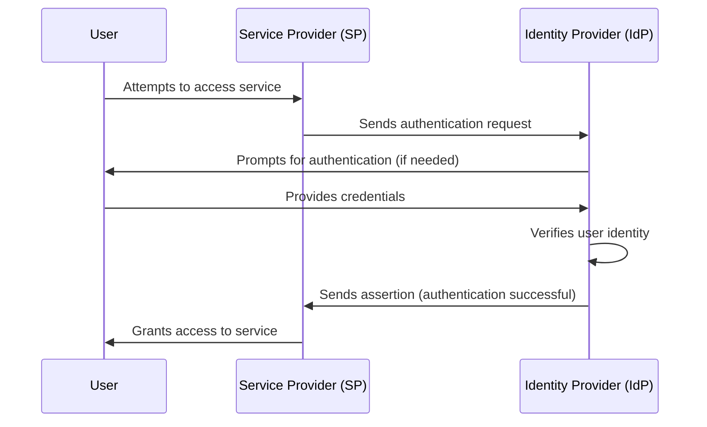

# Security Assertion Markup Language (SAML)

Security Assertion Markup Language (SAML) is an XML-based standard that simplifies user authentication and authorization across diverse web applications and services. It enables single sign-on (SSO), allowing users to access multiple resources with a single login, enhancing security and improving user experience.

SAML operates on a trust relationship between Identity Providers (IdPs) and Service Providers (SPs). The IdP verifies user credentials and issues assertions about their identity, while the SP grants access to protected resources based on these assertions. The SAML authentication process typically involves the user accessing the SP, being redirected to the IdP for login, and then returning to the SP with a SAML assertion that grants access.

SAML offers several key benefits. It enhances security by employing digital signatures and encryption for secure data transmission. It improves the user experience by eliminating the need for multiple logins across different services. Additionally, SAML's open standard ensures interoperability, allowing it to work seamlessly with various IdPs and SPs.

While newer protocols like OpenID Connect are gaining popularity, SAML remains a cornerstone of secure authentication, particularly in enterprise environments due to its robust security features and widespread adoption. Its continued relevance highlights its importance in the evolving landscape of digital identity management.

## SAML in a Nutshell

SAML, which stands for Security Assertion Markup Language, is like a digital passport. It allows websites (Service Providers or SPs) to recognize you based on your verification from another trustworthy source (Identity Provider or IdP).  Imagine it as a system where trusted authorities (IdPs) vouch for your identity, and websites (SPs) accept this vouching to grant you access.  This secure exchange of information enables a streamlined form of single sign-on (SSO).

## How Does SAML Work?

1. Initiation: You try to access a SAML-enabled service (SP), such as a web application.
2. Authentication Request: The SP sends a request to your identity provider (IdP), usually your employer or a trusted third party.
3. Authentication: The IdP verifies your identity, typically using your existing credentials (e.g., company username and password).
4. Assertion: If authentication is successful, the IdP sends an assertion back to the SP, confirming your identity and any relevant attributes (e.g., email, role).
5. Access Granted: The SP trusts the IdP's assertion and grants you access to the service.

## Why you shouldn't use SAML with Mobile Apps and SPAs

**Storing private keys that are required for SAML in mobile apps and SPA is insecure.**

In the SAML protocol messages exchanged between the Service Provider (SP) and the Identity Provider (IdP) should be digitally signed with a public-private key pair. No other flows are available that would bind requests cryptographically to a specific SP.

In case of the SP being a mobile applications and single-page applications, public clients must store the private key. These public clients run on devices or browsers you don't control, making it impossible to safely store the keys essential for SAML's digital signatures.

Exposing private keys in app code or browser JavaScript is a security nightmare, as attackers can potentially extract them. Even obfuscation attempts are futile against determined adversaries. No other flows are available that would bind requests cryptographically to a specific SP.

**Most secure SAML flows are not available for mobile apps**
Moreover, SAML's most secure flows rely on back-channel communication, such as [SAML HTTP Artifact Binding](saml-http-artifact-binding), or POST requests, which is incompatible with the architecture of mobile apps and SPAs. This, coupled with the lack of workarounds that are available in OpenID Connect / OAuth 2.0, leaves SAML messages vulnerable to tampering.

SAML's design, which prioritizes server-side security, clashes with the client-side nature of mobile apps and SPAs, leading to unavoidable security risks.

Instead of finding ways to make SAML work with mobile applications and SPA with proxies and other solutions, it is best practice to leverage trusted and established standards such as Proof Key for Code Exchange (PKCE) flows.

## Industry Standards

* SAML 2.0: Maintained by the [OASIS Security Services Technical Committee](https://www.oasis-open.org/committees/tc_home.php?wg_abbrev=security)

## SAML resources

* [SAML Explained in Plain English](https://www.onelogin.com/learn/saml]) (onelogin.com)
* [What is SAML?](https://www.cloudflare.com/learning/access-management/what-is-saml/) (cloudflare.com)
* [SAML](https://www.pingidentity.com/en/resources/identity-fundamentals/authentication-authorization-standards/saml.html) (pingidentity.com)
